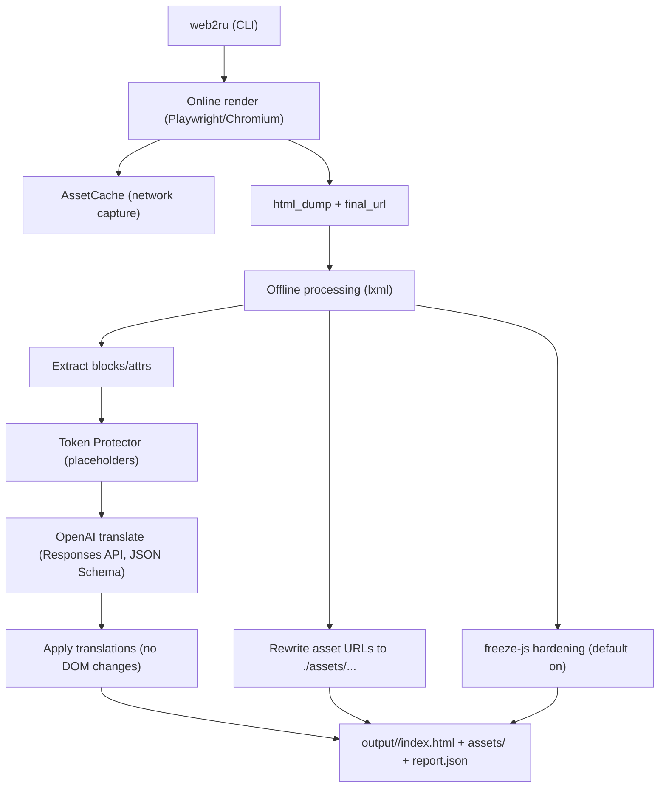

# Web2RU

[](https://github.com/sergeionlyart/web2RU/actions/workflows/ci.yml)

## What Is This

Web2RU is a CLI tool that produces an **offline Russian snapshot** of a web page (EN -> RU) using the approach:
**render the real page + download assets + replace only text** (no HTML regeneration, no DOM rewrites).

Spec (source of truth): `docs/TECHNICAL_SPEC_WEB2RU.md`.

## Key Features

- Two-phase pipeline: online render (Playwright) + offline processing (lxml).
- **DOM integrity**: modifies only text nodes and selected attributes (`title`, `aria-label`, `placeholder`, `alt`).
- Offline purity: output should open locally with **0 external network requests** in default safe mode.
- Translation via OpenAI **Responses API** with **Structured Outputs** (JSON Schema, strict validation).
- Asset capture + scan + best-effort fetch-missing, then rewrite URLs to strict `./assets/...` paths.
- `freeze-js` hardening (default `auto -> on`) for safe offline viewing.
- Optional `--mode surf` for comfortable click-through translation of links (on demand).

## Architecture



More details: `docs/architecture.md`.

## Tech Stack & Requirements

- Python: `>= 3.10`
- Playwright: `>= 1.49` (Chromium is installed via `playwright install chromium`)
- Core libs: `lxml`, `tinycss2`, `httpx`, `openai`, `jsonschema`, `typer`

Supported OS: macOS/Linux (Windows is best-effort).

## Quickstart (Local)

```bash
python -m venv .venv
source .venv/bin/activate
pip install -U pip
pip install -e ".[dev]"
python -m playwright install chromium
```

Create env file (required for translation):
```bash
cp .env.example .env
```

Run (single page):
```bash
web2ru "https://example.com/page" --open
```

Run (surf mode, click-through links):
```bash
web2ru "https://simonwillison.net/" --mode surf --fast --open
```

Stop the local server with `Ctrl+C`.

## Configuration

Web2RU loads env vars in this order:
1. existing environment variables
2. `.env` in current working directory
3. `.env` in repo root

### Environment Variables

| Variable | Required | Default | Notes |
| --- | --- | --- | --- |
| `OPENAI_API_KEY` | yes (for translation) | - | If missing, Web2RU keeps original text and records a warning in `report.json`. |
| `WEB2RU_MODEL` | no | `gpt-5.1` | Can be overridden by `--model`. |
| `WEB2RU_REASONING_EFFORT` | no | `medium` | One of `none/low/medium/high` (if supported by the selected model). |
| `WEB2RU_CACHE_DIR` | no | platform user cache dir | e.g. `~/Library/Caches/web2ru` on macOS. |
| `WEB2RU_OPENAI_RATE_LIMIT_MS` | no | `2500` | Applied only for `openai.com` domain rendering (persistent profile). |
| `WEB2RU_SHADOW_DOM` | no | `auto` | `auto/on/off`. |
| `WEB2RU_ALLOW_EMPTY_PARTS` | no | `on` | `on/off`. |

### Where Files Go

- Output: `output/<slug>/index.html`, `output/<slug>/assets/...`, `output/<slug>/report.json`
- Cache (default): platform cache dir (macOS: `~/Library/Caches/web2ru`)
  - persistent browser profiles: `browser_profiles/<host>/`
  - storage state (cookies, etc.): `storage_state/<host>.json`
  - translation cache: `translation_cache.sqlite` (name may vary by version)

Treat cache contents as sensitive (may include cookies/session state).

## Docker Setup

Not provided yet. Playwright + Chromium in Docker is doable, but needs a dedicated base image and system deps.
See Roadmap.

## Tests & Lint

```bash
ruff format .
ruff check .
mypy src
pytest -q
```

## Repo Structure

```
src/web2ru/
  cli.py
  pipeline/          # online render + offline process orchestration
  assets/            # capture, scan, fetch-missing, rewrite
  extract/           # scope detection, block/text extraction
  translate/         # batching, OpenAI client, schema validation, cache
  apply/             # apply translations back to exact nodes/attrs
  freeze/            # JS neutralization/sanitization for offline viewing
  surf/              # on-demand click-through translation server
  report/            # report.json builder
docs/
tests/
```

## Limitations

- Anti-bot / access challenges can block some sites (including `openai.com`). Web2RU detects common interstitials
  and fails with a clear error instead of producing a fake "translation".
- Authenticated / paywalled content is best-effort. Medium requires manual login capture (`--auth-capture on`).
- Complex interactive SPAs are not a goal; Web2RU targets readable offline snapshots.
- 100% asset completeness is not guaranteed (CDN limits, timing, anti-bot).

## Roadmap

- Docker support (reproducible container image).
- Better translation consistency (cross-block harmonization, richer context).
- More auth providers beyond Medium (opt-in, user-driven).
- Faster surf navigation (dedup, concurrency controls, budgets).

## Contributing

See:
- `CONTRIBUTING.md`
- `CODE_OF_CONDUCT.md`
- `SECURITY.md`

## License

MIT, see `LICENSE`.

---

# Web2RU (RU)

## Что Это

Web2RU это CLI-утилита, которая делает **офлайн снапшот страницы на русском** (EN -> RU) по принципу:
**рендерим реальную страницу + скачиваем ассеты + заменяем только текст** (без генерации нового HTML и без ломания DOM).

Спецификация (source of truth): `docs/TECHNICAL_SPEC_WEB2RU.md`.

## Ключевой Функционал

- Двухфазный пайплайн: online render (Playwright) + offline обработка (lxml).
- **Сохранение DOM**: меняем только текстовые ноды и выбранные атрибуты (`title`, `aria-label`, `placeholder`, `alt`).
- Офлайн-режим: в безопасном режиме результат должен открываться с **0 внешних запросов**.
- Перевод через OpenAI **Responses API** с **Structured Outputs** (JSON Schema, строгая валидация).
- Захват ассетов + scan + best-effort fetch-missing, затем переписывание ссылок на строго `./assets/...`.
- `freeze-js` (по умолчанию `auto -> on`) для безопасного офлайн просмотра.
- `--mode surf` для комфортного серфинга по ссылкам с переводом по клику (on demand).

## Архитектура

Схема и контракты: `docs/architecture.md`.

## Стек И Требования

- Python: `>= 3.10`
- Playwright: `>= 1.49` (Chromium ставится через `playwright install chromium`)

Поддержка: macOS/Linux (Windows best-effort).

## Быстрый Старт (Локально)

```bash
python -m venv .venv
source .venv/bin/activate
pip install -U pip
pip install -e ".[dev]"
python -m playwright install chromium
```

Создайте `.env` (нужен для перевода):
```bash
cp .env.example .env
```

Запуск (одна страница):
```bash
web2ru "https://example.com/page" --open
```

Surf-режим (переход по ссылкам):
```bash
web2ru "https://simonwillison.net/" --mode surf --fast --open
```

Остановить локальный сервер: `Ctrl+C`.

## Конфигурация

См. `.env.example` и секцию Environment Variables выше.

## Docker

Пока нет. Это в Roadmap.

## Тесты И Линтеры

```bash
ruff format .
ruff check .
mypy src
pytest -q
```

## Ограничения

- Anti-bot/челленджи могут блокировать некоторые сайты (включая `openai.com`).
- Авторизованные сайты/paywall: best-effort. Для Medium нужен ручной login capture (`--auth-capture on`).
- Интерактивные SPA офлайн не являются целью; фокус на читаемых снапшотах.
- 100% полнота ассетов не гарантируется (CDN, тайминги, антибот).

## Контрибьютинг

См. `CONTRIBUTING.md`, `CODE_OF_CONDUCT.md`, `SECURITY.md`.

## Лицензия

MIT, см. `LICENSE`.
